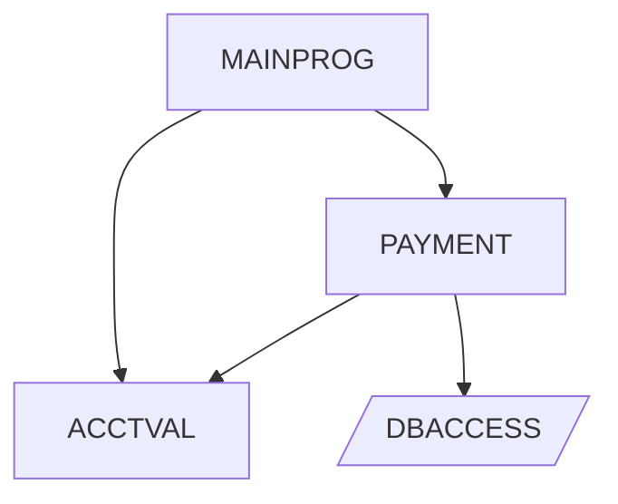

# Output Gallery

This page shows example artifacts produced by `cobol-intel` to illustrate what
a typical analysis run generates.

## Manifest (excerpt)

```json
{
  "schema_version": "1.0",
  "tool_version": "0.2.0",
  "run_id": "run_20260401_001",
  "project_name": "samples",
  "status": "completed",
  "artifacts": {
    "ast": ["ast/payment_ast.json"],
    "graphs": ["graphs/call_graph.json", "graphs/call_graph.md"],
    "rules": ["rules/payment_rules.json", "rules/payment_rules.md"],
    "docs": ["docs/payment_explanation.json", "docs/payment_explanation.md"]
  },
  "governance": {
    "approved_backend": "claude",
    "token_usage": { "total_tokens": 4820 },
    "sensitivity_level": "internal"
  }
}
```

## Business Rules Table

| Rule ID | Type | Condition | Paragraph | Actions |
|---------|------|-----------|-----------|---------|
| R001 | IF | `WS-BALANCE > 0` | VALIDATE-ACCOUNT | PERFORM PROCESS-PAYMENT |
| R002 | EVALUATE | `WS-TRANS-CODE` | PROCESS-TRANSACTION | PERFORM DEPOSIT, PERFORM WITHDRAWAL |
| R003 | IF | `WS-STATUS = 'INACTIVE'` | CHECK-STATUS | DISPLAY ERROR-MESSAGE |

## Call Graph (Mermaid)



## LLM Explanation (excerpt)

### Program Summary

PAYMENT processes financial transactions by validating account status through
ACCTVAL, computing transaction amounts with interest calculations, and
recording results to the transaction log file. It enforces business rules
around balance thresholds and account status before allowing any fund movement.

### Paragraph: VALIDATE-ACCOUNT

Checks whether WS-ACCOUNT-STATUS is 'ACTIVE' and WS-BALANCE exceeds the
minimum threshold (WS-MIN-BALANCE). If validation fails, sets WS-ERROR-CODE
to 'E001' and performs ERROR-HANDLER. On success, moves WS-ACCOUNT-ID to the
output record and performs PROCESS-PAYMENT.

## Impact Analysis

```text
[cobol-intel] impact: 3 program(s) affected
  MAINPROG (transitive_caller, depth=2): Transitive caller of DBACCESS (depth 2)
  PAYMENT (direct_caller, depth=1): Calls DBACCESS
  ACCTVAL (field_reference, depth=0): References field WS-BALANCE
```

## HTML Report

The `--format html` option generates a self-contained HTML report with:
- Embedded CSS and Mermaid JS for zero-dependency viewing
- Sidebar navigation with search/filter
- Collapsible per-program sections
- Data dictionary tables, procedure flow, and business rules
